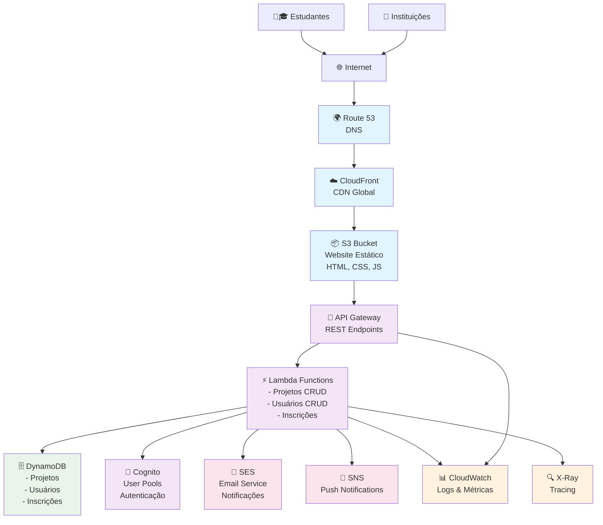

# 🦫 CapiEdu - Plataforma Educacional

Uma aplicação web para conectar estudantes e instituições através de projetos educacionais locais.

## 🚀 Funcionalidades

- **Login diferenciado**: Estudantes e Instituições
- **Cadastro de projetos**: Instituições podem criar projetos
- **Busca e filtros**: Por cidade e categoria
- **Sistema de inscrições**: Estudantes podem se inscrever
- **Gerenciamento**: Instituições gerenciam projetos, estudantes gerenciam inscrições
- **Interface fofa**: Tema de capivaras com animações

## 📁 Estrutura do Projeto

```
novoprojeto-bruna/
├── index.html          # Página principal
├── style.css           # Estilos da aplicação
├── script.js           # Lógica JavaScript
├── test.html           # Interface de testes
├── tests.js            # Testes unitários
└── README.md           # Este arquivo
```

## 🧪 Como Executar os Testes

### Testes Visuais (Recomendado)
1. Abra o arquivo `test.html` no navegador
2. Os testes executam automaticamente
3. Veja os resultados com interface visual

### Testes no Console
1. Abra o console do navegador (F12)
2. Carregue o arquivo `tests.js`
3. Veja os resultados no console

## 🦫 Testes Implementados

### ✅ Validações
- **CNPJ**: Verifica formato correto (14 dígitos)
- **Email**: Valida formato de email
- **Campos obrigatórios**: Todos os campos necessários

### ✅ Funcionalidades
- **Criação de projetos**: Dados válidos e inválidos
- **Filtros de busca**: Por cidade e categoria
- **Sistema de inscrições**: Criação e duplicatas
- **Remoção**: Projetos e inscrições
- **LocalStorage**: Persistência de dados

### ✅ Interface
- **Navegação**: Entre seções
- **Formatação**: Datas e textos
- **Conversões**: Cidade para minúscula

## 🎯 Como Usar a Aplicação

1. **Abra** `index.html` no navegador
2. **Faça login** como Estudante ou Instituição
3. **Estudantes**: Veja projetos e se inscreva
4. **Instituições**: Cadastre e gerencie projetos

## 🦫 Características Especiais

- **Bolhas animadas** no fundo
- **Capivara fofa** no canto da tela
- **Cores azuis e brancas** com traços delicados
- **Responsivo** e acessível
- **Dados persistentes** no navegador

## 🔧 Tecnologias

- HTML5
- CSS3 (Animações e Gradientes)
- JavaScript Vanilla
- LocalStorage para persistência

## ☁️ Arquitetura AWS

### 📊 Diagrama de Arquitetura



### 🏗️ Serviços Utilizados

#### **Frontend**
- **Amazon S3**: Hospedagem dos arquivos estáticos (HTML, CSS, JS)
- **Amazon CloudFront**: CDN global para performance
- **Route 53**: DNS e domínio customizado

#### **Backend**
- **API Gateway**: Endpoints REST para APIs
- **AWS Lambda**: Funções serverless para lógica de negócio
- **Amazon DynamoDB**: Banco NoSQL para projetos e usuários
- **Amazon Cognito**: Autenticação e autorização

#### **Comunicação**
- **Amazon SES**: Envio de emails (confirmações, notificações)
- **Amazon SNS**: Notificações push e SMS

#### **Monitoramento**
- **CloudWatch**: Logs, métricas e alertas
- **AWS X-Ray**: Tracing e análise de performance

### 💰 Estimativa de Custos (Mensal)

#### **Cenário Pequeno** (até 1.000 usuários)
- S3 + CloudFront: $2-5
- Lambda (100K execuções): $1-3
- DynamoDB (25GB): $3-6
- API Gateway: $3-7
- SES (10K emails): $1
- Cognito (1K usuários): $0-3
- **Total: $10-25/mês**

#### **Cenário Médio** (até 10.000 usuários)
- S3 + CloudFront: $5-15
- Lambda (1M execuções): $5-10
- DynamoDB (100GB): $12-25
- API Gateway: $15-35
- SES (50K emails): $5
- Cognito (10K usuários): $15-25
- **Total: $57-115/mês**

#### **Cenário Grande** (até 100.000 usuários)
- S3 + CloudFront: $20-50
- Lambda (10M execuções): $20-40
- DynamoDB (500GB): $60-125
- API Gateway: $100-300
- SES (200K emails): $20
- Cognito (100K usuários): $275-550
- **Total: $495-1.085/mês**

### 🎯 Benefícios da Arquitetura

- **Escalabilidade**: Cresce automaticamente com a demanda
- **Disponibilidade**: 99.9% uptime garantido
- **Performance**: CDN global e cache inteligente
- **Segurança**: Autenticação robusta e criptografia
- **Custo-efetivo**: Paga apenas pelo que usar
- **Manutenção zero**: Serverless elimina gerenciamento de servidor

## 🚀 Deploy na AWS

### Pré-requisitos
- AWS CLI instalado e configurado
- Conta AWS ativa
- Permissões para S3, CloudFront e Route 53

### Scripts Disponíveis

#### Deploy Completo (S3 + CloudFront)
```bash
./deploy-aws.sh
```
- Cria bucket S3
- Configura website estático
- Upload dos arquivos
- Cria distribuição CloudFront
- Configura cache e SSL

#### Deploy Simples (Apenas S3)
```bash
./deploy-simple.sh
```
- Deploy rápido apenas com S3
- Ideal para testes

#### Limpeza de Recursos
```bash
./cleanup-aws.sh
```
- Remove buckets e arquivos
- Evita custos desnecessários

### Após o Deploy
1. Acesse a URL fornecida pelo script
2. Teste todas as funcionalidades
3. Configure domínio customizado (opcional)
4. Configure monitoramento no CloudWatch

tag:  q-developer-quest-tdc-2025

---

Feito com 🦫 e muito carinho!
